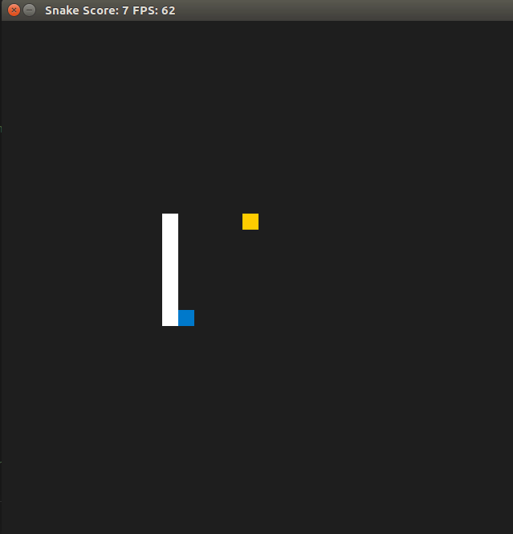

# CPPND: Capstone Snake Game Example

## Table of Contents
- [Introduction](#introduction)
- [Dependencies for Running Locally](#dependencies-for-running-locally)
- [Basic Build Instructions](#basic-build-instructions)
- [New Features Added](#new-features-added)
- [Feature Ideas](#feature-ideas)
- [Project Rubric](#project-rubric)
  - [README (All Rubric Points REQUIRED)](#readme-all-rubric-points-required)
  - [Compiling and Testing (All Rubric Points REQUIRED)](#compiling-and-testing-all-rubric-points-required)
  - [Loops, Functions, I/O - meet at least 2 criteria](#loops-functions-io---meet-at-least-2-criteria)
  - [Object Oriented Programming - meet at least 3 criteria](#object-oriented-programming---meet-at-least-3-criteria)
  - [Memory Management - meet at least 3 criteria](#memory-management---meet-at-least-3-criteria)
  - [Concurrency - meet at least 2 criteria](#concurrency---meet-at-least-2-criteria)
- [References](#references)
- [CC Attribution-ShareAlike 4.0 International](#cc-attribution-sharealike-40-international)

## Introduction
This is a starter repo for the Capstone project in the [Udacity C++ Nanodegree Program](https://www.udacity.com/course/c-plus-plus-nanodegree--nd213). The code for this repo was inspired by [this](https://codereview.stackexchange.com/questions/212296/snake-game-in-c-with-sdl) excellent StackOverflow post and set of responses.

The Capstone Project gives you a chance to integrate what you've learned throughout this program. This project will become an important part of your portfolio to share with current and future colleagues and employers.

In this project, you can build your own C++ application or extend this Snake game, following the principles you have learned throughout this Nanodegree Program. This project will demonstrate that you can independently create applications using a wide range of C++ features.

## Dependencies for Running Locally
* cmake >= 3.7
  * All OSes: [click here for installation instructions](https://cmake.org/install/)
* make >= 4.1 (Linux, Mac), 3.81 (Windows)
  * Linux: make is installed by default on most Linux distros
  * Mac: [install Xcode command line tools to get make](https://developer.apple.com/xcode/features/)
  * Windows: [Click here for installation instructions](http://gnuwin32.sourceforge.net/packages/make.htm)
* SDL2 >= 2.0
  * All installation instructions can be found [here](https://wiki.libsdl.org/Installation)
  >Note that for Linux, an `apt` or `apt-get` installation is preferred to building from source. 
* gcc/g++ >= 5.4
  * Linux: gcc / g++ is installed by default on most Linux distros
  * Mac: same deal as make - [install Xcode command line tools](https://developer.apple.com/xcode/features/)
  * Windows: recommend using [MinGW](http://www.mingw.org/)

## Basic Build Instructions

1. Clone this repo.
2. Make a build directory in the top level directory: `mkdir build && cd build`
3. Compile: `cmake .. && make`
4. Run it: `./SnakeGame`.

## New Features Added
**12/02/2024** - Added a leaderboard. The leaderboard is saved to a text file. The leaderboard is displayed at the end of the game. The leaderboard is sorted by the highest score. The leaderboard is limited to the top 10 scores. The leaderboard is initialised using `std::async` in case the file to load is very large.

**18/02/2024** - To meet the concurrency requirement, I've implemented a second food that exists for a specified time. The food is "bad", rendered as a red square and disappears after 10s. A thread is required so that a timing loop can run without blocking the main thread of execution.

## Feature Ideas

- **Make the game look better**:
  - Add a background image.
  - Add a game over screen.
  - Add a start screen.
  - Add a pause screen.
  - Add a settings screen.
  - Add a game over sound.
  - Add a sound when the snake eats food.
  - Add a sound when the snake dies.
  - Add a sound when the snake moves.
  - Add a sound when the snake changes direction.
  - Add a sound when the snake speeds up.
  - Add a sound when the snake slows down
  - Add a graphical leaderboard at the end of the game.
  - Render items with sprites instead of squares.
- **Explore software design ideas**:
  - Manage the snake and food on different threads.
  - Have a parent class to track all consummables.
  - Have each consumable managed by it's own thread. Aim to understand the benefits of just using a loop.
- **Add new mechanics to the game**:
  - A consumable with a message queue to decide when to draw a new consumable/change the state of a consumable for the renderer e.g. food that becomes a barrier.
  - A consumable that makes the snake go into "ghost" mode temporarily.
  - A consumable that goes bad/mouldy and reduces a player's score.
  - A moving consumable.
  - A consumable that behaves as a barrier
  - A consumable that implement a hard barrier around the games's border temporarily.
- **Functionality Improvements**:
  - Allow players to select game settings e.g. the intial speed of the snake.
  - Add another snake to the game that is controlled by the computer using the A* search algorithm.
  - Add two player mode.
  - Add replay functionality to the game, storing the game state at each frame (or ever n frames) and then replaying the game from the start. Admittedly, you could just record the snakes's position and the food's position and then replay the game from the start.

	- 
## Project Rubric

### README (All Rubric Points REQUIRED)

| Done | Success Criteria | Specifications | Evidence |
|------|------------------|----------------|----------|
| &#9745; | A README with instructions is included with the project | The README is included with the project and has instructions for building/running the project. If any additional libraries are needed to run the project, these are indicated with cross-platform installation instructions. You can submit your writeup as markdown or pdf. | A README has been included with instructions to build the project. |
| &#9745; | The README indicates the new features you added to the game | The README indicates the new features you added to the game, along with the expected behavior or output of the program. | See the *New Features Added* Section.          |
| &#9745; | The README includes information about each rubric point addressed | The README indicates which rubric points are addressed. The README also indicates where in the code (i.e. files and line numbers) that the rubric points are addressed. | See the current section. |

### Compiling and Testing (All Rubric Points REQUIRED)

| Done | Success Criteria | Specifications | Evidence |
|------|------------------|----------------|----------|
| &#9745; | The submission must compile without any errors on the Udacity project workspace. | We strongly recommend using cmake and make, as provided in the starter repos. If you choose another build system, the code must be compiled on the Udacity project workspace. | The code has been compiled on the Udacity workspace. |

### Loops, Functions, I/O - meet at least 2 criteria

| Done | Success Criteria | Specifications | Evidence |
|------|------------------|----------------|----------|
| &#9745; | The project demonstrates an understanding of C++ functions and control structures. | A variety of control structures are added to the project. The project code is clearly organized into functions. | *leaderboard.cpp* uses for, while and if loops, switch-case blocks and try-catch blcoks. Each class has functions with clearly defined scope.         |
| &#9745; | The project reads data from a file and process the data, or the program writes data to a file. | The project reads data from an external file or writes data to a file as part of the necessary operation of the program. | *learderboard.cpp* has `getRecords` and `saveRecords` methods, starting on lines 62 and 77 respectively, which read and write data to a file. |
|      | The project accepts user input and processes the input. | In addition to controlling the snake, the game can also receive new types of input from the player. |          |
| &#9745; | The project uses data structures and immutable variables. | The project uses arrays or vectors and uses constant variables. | The `Leaderboard` class stores each game result in a vector of `Records` as shown on line 41 of *leaderboard.h.* From line 15 of *leaderboard.h* the copy constructor ad copy-assignment operator for the `Record` class are defined, which take inputs defined as `const`. |

### Object Oriented Programming - meet at least 3 criteria

| Done | Success Criteria | Specifications | Evidence |
|------|------------------|----------------|----------|
| &#9745; | One or more classes are added to the project with appropriate access specifiers for class members. | Classes are organized with attributes to hold data and methods to perform tasks. All class data members are explicitly specified as public, protected, or private. Member data that is subject to an invariant is hidden from the user and accessed via member methods. | *leaderboard.h* declares both the `Leaderboard` and `Record` classes. |
| &#9745; | Class constructors utilize member initialization lists. | All class members that are set to argument values are initialized through member initialization lists. | The `Record` class uses an initialiser list for the constructor defined on line 3 of *leaderboard.cpp*.  |
| &#9745; | Classes abstract implementation details from their interfaces. | All class member functions document their effects, either through function names, comments, or formal documentation. Member functions do not change the program state in undocumented ways. | The `Record` class's implementation is abstracted from it's interface. We can change our records without changing how the `Record` class is used by the `Leaderboard` class.     |
| &#9745; | Overloaded functions allow the same function to operate on different parameters. | One function is overloaded with different signatures for the same function name. | The `Record` class has two constructors with different function signatures defined on lines 3 and 5 of *leaderboard.cpp* |
|        | Classes follow an appropriate inheritance hierarchy. | Inheritance hierarchies are logical. On member functions in an inherited class override virtual base class functions. |          |
|      | Template generalise functions in the project. | One function or class is declared with a template that allows it to accept a generic parameter. |          |

### Memory Management - meet at least 3 criteria

| Done | Success Criteria | Specifications | Evidence |
|------|------------------|----------------|----------|
| &#9745; | The project makes use of references in function declarations. | At least two variables are defined as references, or two functions use pass-by-reference in the project code. | The `Record` class' constructor defined on line 5 of *leaderboard.cpp* and `write` method defined on line 46 of *leaderboard.cpp* use pass by reference.|
|      | The project uses destructors appropriately. | At least one class that uses unmanaged dynamically allocated memory, along with any class that otherwise needs to modify state upon the termination of an object, uses a destructor. |          |
|      | The project uses scope / Resource Acquisition Is Initialization (RAII) where appropriate. | The project follows the Resource Acquisition Is Initialization pattern where appropriate, by allocating objects at compile-time, initializing objects when they are declared, and utilizing scope to ensure their automatic destruction. |          |
| &#9745; | The project follows the Rule of 5. | For all classes, if any one of the copy constructor, copy assignment operator, move constructor, move assignment operator, and destructor are defined, then all of these functions are defined. | Added the rule of 5 to the `Record` class as the move constructor will be called from the `addRecord` method of the `Leaderboard` class defined on line 58 of *leaderboard.cpp*.  |
| &#9745; | The project uses move semantics to move data instead of copying it, where possible. | The project relies on the move semantics, instead of copying the object. |  The `Leaderboard` class uses move semantics to add r-value `Records` on line 58 of *leaderboard.cpp* |
|      | The project uses smart pointers instead of raw pointers. | The project uses at least one smart pointer: unique_ptr, shared_ptr, or weak_ptr. |          |

### Concurrency - meet at least 2 criteria

| Done | Success Criteria | Specifications | Evidence |
|------|------------------|----------------|----------|
| &#9745; | The project uses multithreading. | The project uses multiple threads or async tasks in the execution. | `std::async` is used to load the current leaderboard on line 21 of *main.cpp*. A thread is used for the `bad_food` timer on line 93 of *game.cpp* |
|  | A promise and future is used in the project. | A promise and future is used to pass data from a worker thread to a parent thread in the project code. | A `Leaderboard` class future is created on lines 21 of *main.cpp*, respectively. |
| &#9745; | A mutex or lock is used in the project. | A mutex or lock (e.g. `std::lock_guard` or `std::unique_lock`) is used to protect data that is shared across multiple threads in the project code. | The `BadFood` class, implemented in *bad_food.cpp*, demonstrates extensive use of locks and mutexes to ensure that `bad-food` in *game.cpp* is accessed in a thread-safe way. |
| &#9745; | A condition variable is used in the project. | A std::condition_variable is used in the project code to synchronize thread execution. | A condition variable is used to cancel our timing loop immediately, without waiting for the 0.5s rest interval in the `BadFoodTimer` method to elapse. See the `BadFoodTimer` and `Cancel` methods starting on lines 26 and 42 of *bad_food.cpp*, respectively. |

## References

- [The StackExchange post that inspired this project](https://codereview.stackexchange.com/questions/212296/snake-game-in-c-with-sdl)
- [An example of a great submission](https://github.com/nihguy/cpp-snake-game/tree/master) - maybe I'll do this one day.
- [An explanation of the game loop](https://www.informit.com/articles/article.aspx?p=2928180&seqNum=4)
- [Another explanation of the game loop](https://gameprogrammingpatterns.com/game-loop.html)
- [Lazy Foo SDL Tutorials](https://lazyfoo.net/tutorials/SDL/01_hello_SDL/linux/index.php)
- [Parallel Realities SDL Tutorials](https://www.parallelrealities.co.uk/tutorials/)
- [TwinklebearDev SDL Tutorials](https://www.willusher.io/pages/sdl2/)
- [SDL Wiki](https://wiki.libsdl.org/SDL2/FrontPage)

## CC Attribution-ShareAlike 4.0 International

Shield: [![CC BY-SA 4.0][cc-by-sa-shield]][cc-by-sa]

This work is licensed under a
[Creative Commons Attribution-ShareAlike 4.0 International License][cc-by-sa].

[![CC BY-SA 4.0][cc-by-sa-image]][cc-by-sa]

[cc-by-sa]: http://creativecommons.org/licenses/by-sa/4.0/
[cc-by-sa-image]: https://licensebuttons.net/l/by-sa/4.0/88x31.png
[cc-by-sa-shield]: https://img.shields.io/badge/License-CC%20BY--SA%204.0-lightgrey.svg
