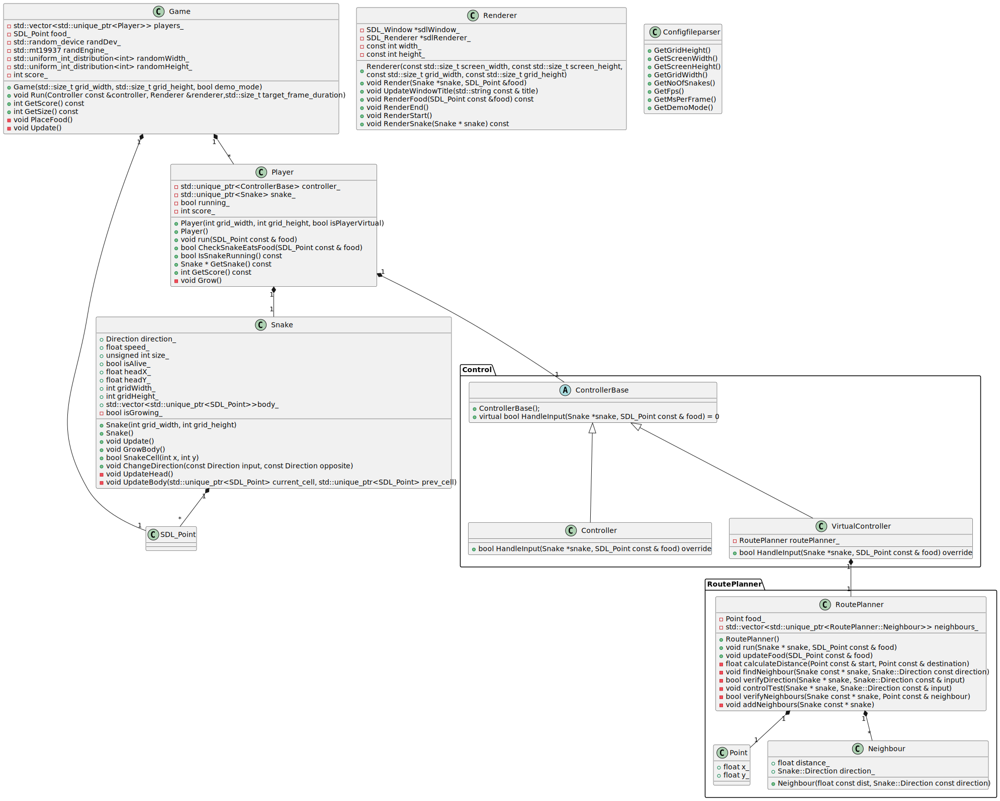
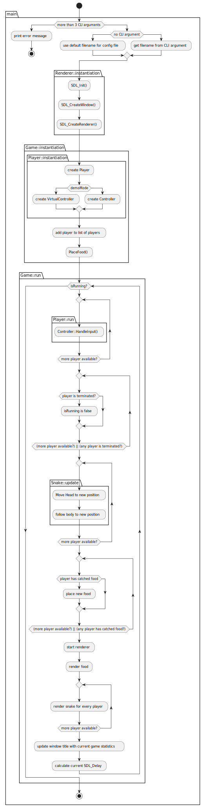
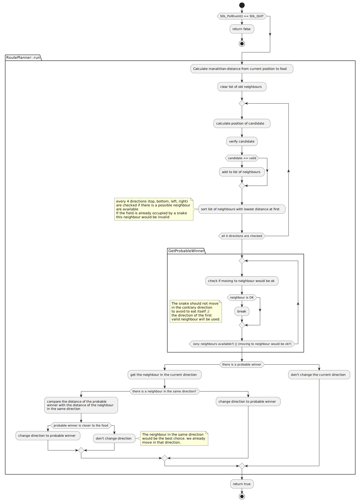

# CPP nanodegree: Capstone - Snake extended

This is a clone from the starter repo for the (Capstone project)[https://github.com/udacity/CppND-Capstone-Snake-Game] in the [Udacity C++ Nanodegree Program](https://www.udacity.com/course/c-plus-plus-nanodegree--nd213).  

The starter repo was refactored and extended with the following new features:  

- a configuration file (e.g. change size of food, snake and the size of the game area)
- a demonstration mode (automatically play of the computer without any interaction of a human player)
- one-to-one battle (human vs computer)

  

## Dependencies for Running Locally

- cmake >= 3.7
  - All OSes: [click here for installation instructions](https://cmake.org/install/)
- make >= 4.1 (Linux, Mac), 3.81 (Windows)
  - Linux: make is installed by default on most Linux distros
  - Mac: [install Xcode command line tools to get make](https://developer.apple.com/xcode/features/)
  - Windows: [Click here for installation instructions](http://gnuwin32.sourceforge.net/packages/make.htm)
- SDL2 >= 2.0
  - All installation instructions can be found [here](https://wiki.libsdl.org/Installation)
  >Note that for Linux, an `apt` or `apt-get` installation is preferred to building from source. 
- gcc/g++ >= 5.4
  - Linux: gcc / g++ is installed by default on most Linux distros
  - Mac: same deal as make - [install Xcode command line tools](https://developer.apple.com/xcode/features/)
  - Windows: recommend using [MinGW](http://www.mingw.org/)

## Basic Build Instructions

1. Clone this repo.
2. Make a build directory in the top level directory: `mkdir build && cd build`
3. Compile: `cmake .. && make`
4. Adapt the deployed (configuration file)[https://github.com/Sepphod/CppND-Capstone-Snake-Game/blob/master/src/snake.cfg].
5. Run it: `./SnakeGame`../src/snake.cfg. If no config file is provided default values will be used. The default values can be found in (settings.h)[https://github.com/Sepphod/CppND-Capstone-Snake-Game/blob/master/src/settings.h]

## Configuration

Via the [configuration file snake.cfg](https://github.com/Sepphod/CppND-Capstone-Snake-Game/blob/master/src/snake.cfg) it is possible to modify:

- the size of the play area on the screen 
  - ScreenWidth and ScreenHeight
- the resolution of the play area by changing the grid size (it affects the size of the food and the snake)
  - GridWidth and GridHeight
- the refresh rate with which the play is displayed
  - FramesPerSecond
- the number of snakes which try to reach the food (currently limited to 1)
  - NumOfSnakes
- Automatic playing by a virtual player 
  - DemoMode (1 - on and 0 - off)

## SW design

### Static SW design

Below the class diagram. Almost all SW modules are implemented as CPP classes or structs. Only the parsing of the configuration file is implemented as free functions. Those free functions base on a template function.  
The main class is ___Game___. It owns the food and the players. If any of the snakes has eaten the food it will be placed on a new location by ___Game___. The players are a vector of smart pointers to the class ___Player___.  
Every object of ___Player___ owns __one__ object of class ___Snake___ and __one__ object of ___ControllerBase___. The class ___Player___ controls the moving of its ___Snake___. It checks if the ___Snake___ has eaten the food. In that case the snake increases its size. Further it checks if the snake has not accidentally eaten itself. In that case the game would be over.  
The class ___Snake___ is the representation of a snake with its head and its body. At the start of the game the body has a size of 0. With every food eaten by the snake the body increases by one. The body is a vector of smart pointers of ___SDL_Point___. If the body increases __std::make_unique<SDL_Point>__ is called.
The snake can be controlled by a real entrys via the keyboard or by calculating the best direction the snake shall head in order to reach the food. The class ___Controller___ is responsible for the input via keyboard and ___VirtualController___ is responsible for the calculation of the next step during the Demomode. As the player should not care about the kind of controller both were abstracted with a base class ___ControllerBase___ which specify by virtual function the common API. That API is used by the ___Player___.  
The ___VirtualController___ outsources the calculation of the next step to ___RoutePlanner___. Which calculates the manhattan-distance of the current head to the food. It checks the possible neighbour positions and decides the best next neighbour. This leads to the direction whiches the ___VirtualController___ will use during the current game cycle to control the snake. Either the snake changes its direction or it keeps going in the same direction.

The implementation follows the rule of 5. Behaviour is encapsulated in dedicated classes or structs as it fits most. There is no usage of raw pointers. Only smart pointers regarding their ownership are used.

### Dynamic SW design

The game is started via the commandline. The main function verifies the provided parameters. Afterwards the one object of the type ___Renderer__ and one object of the type ___Game___ are instantiated.  
Within the constructor the configured number of ___Player___ are instantiated. Depending on a input parameter the constructor of ___Player___ instantiates either a ___VirtualController___ or a ___Controller___. At last action in the constructor of Game the food is placed randomly somewhere in the game area.
After all initialization the main function calls ___Game.run()___. Which is a classic `while`-loop. It will be executed as long as you terminate the application (typically by pressing `CMD or CTRL - C`). A Player `dies` if it touches itself or another player.  
At first within the `while`-loop the control inputs for all ___Player___ will be evaluated. The control inputs lead to a new position for the ___Snake___s. Which will be evaluated if any snake will eats itself. This will stop the game. The while-loop is still executed. But any input from a controller won't be accepted. 
Than the food and the ___Snake___ of every ___Player___ are rendered. At the end of any game cycle the game statistics are updated and the display delay are calculated.

#### Route planning

The ___VirtualController___ controls the snake without any interaction of any human player. In every game cycle the possible neighbours of the head of the snake in all 4 directions (UP, DOWN, LEFT, RIGHT) are evaluated. The criterias are

- distance to the food
- already not occupied by any part of any snake
- neighbour is not in the opposite direction

The distance is calculated as [Manhattan-Distance](https://en.wikipedia.org/wiki/Taxicab_geometry). The list of neighbours is sorted with the shortest distance as sorting criteria.

## Capstone rubric points

The following rubric points are addressed within this project:

- Compilation and execution without any error
- usage of loops, control structures and functions
- Techniques of object-oriented programming (abstract classes and their child classes)
- Memory Management (usage of smart pointer - strict avoidance of raw pointers, rule-of-5)
- Concurrency is still missing

## CC Attribution-ShareAlike 4.0 International

Shield: [![CC BY-SA 4.0][cc-by-sa-shield]][cc-by-sa]

This work is licensed under a
[Creative Commons Attribution-ShareAlike 4.0 International License][cc-by-sa].

[![CC BY-SA 4.0][cc-by-sa-image]][cc-by-sa]

[cc-by-sa]: http://creativecommons.org/licenses/by-sa/4.0/
[cc-by-sa-image]: https://licensebuttons.net/l/by-sa/4.0/88x31.png
[cc-by-sa-shield]: https://img.shields.io/badge/License-CC%20BY--SA%204.0-lightgrey.svg
